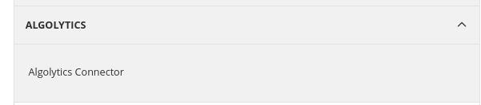
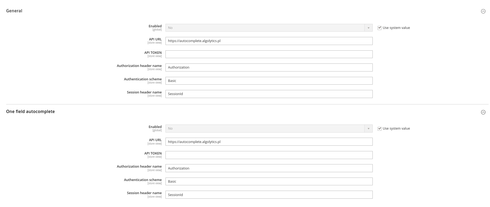

<h1 align="center">Algolytics AlgoIntegration</h1> 

<div align="center">
  <p>Integrate Magento2 with Autocomplete Algolytics API.</p>
  
  <a href="https://opensource.org/licenses/MIT" target="_blank"></a>
</div>

## Table of contents

- [Summary](#summary)
- [Installation](#installation)
- [Configuration](#configuration)
- [License](#license)

## Summary

This module allows you to automatically complete the customer address at checkout and in the customer address form, using the <a href="https://algomaps.pl/demo/demo-autocomplete/">Autocomplete Algolytics API</a>

## Installation

```
composer require algolytics/module-algo-integration
bin/magento module:enable Algolytics_AlgoIntegration
bin/magento setup:upgrade
```

## Configuration
* Stores -> Configuration -> Algolytics -> Algolytics Connector



## License

[MIT](https://opensource.org/licenses/MIT)

